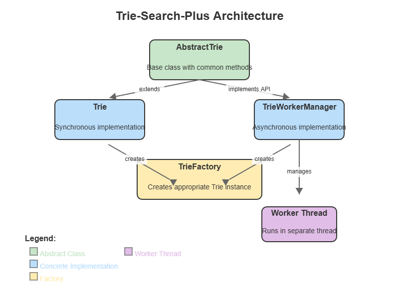
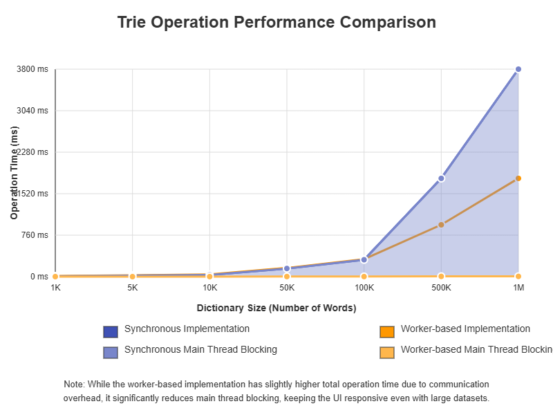
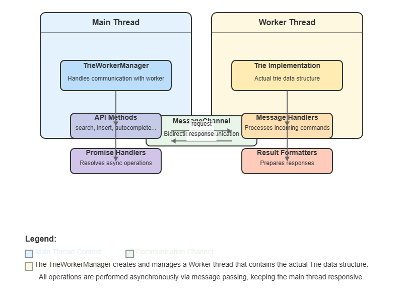

# Trie-Search-Plus

A powerful, lightweight Trie-based search and autocomplete library for JavaScript applications.

## Table of Contents

- [Features](#features)
- [Installation](#installation)
- [Usage](#usage)
  - [Basic Usage](#basic-usage)
  - [Advanced Features](#advanced-features)
  - [Worker-Based Implementation](#worker-based-implementation)
- [Generating Visualizations](#generating-visualizations)
- [API Reference](#api-reference)
- [Browser Compatibility](#browser-compatibility)
- [Contributing](#contributing)
- [License](#license)
- [Author](#author)

## Features

- **Exact Word Search**: Fast lookup for complete words
- **Prefix Matching**: Find words that start with a specific prefix
- **Autocomplete**: Get suggestions based on a partial input
- **Fuzzy Search**: Find words with spelling errors (using Levenshtein distance)
- **Wildcard Search**: Use "." as a wildcard character to match any letter
- **Word Deletion**: Remove words from the trie
- **Word Counting**: Count the total number of words in the trie
- **Word Listing**: Get all words stored in the trie
- **Worker Thread Support**: Offload trie operations to a separate thread
- **Unified API**: Consistent interface for both synchronous and asynchronous implementations
- **Factory Pattern**: Simple creation of appropriate trie implementation based on requirements


*Architecture diagram showing the relationship between Trie, TrieFactory, and TrieWorkerManager*

## Installation

You can install Trie-Search-Plus using npm, yarn, or include it directly via CDN:

### npm
```bash
npm install trie-search-plus
```

### Yarn
```bash
yarn add trie-search-plus
```

### CDN
```html
<!-- UMD build (for direct browser usage) -->
<script src="https://unpkg.com/trie-search-plus/dist/trie-search-plus.umd.js"></script>

<!-- ES Module build -->
<script type="module">
  import { Trie, TrieFactory } from 'https://unpkg.com/trie-search-plus/dist/trie-search-plus.esm.js';
</script>
```

## Usage

### Basic Usage

```javascript
import { Trie } from 'trie-search-plus';

// Create a new Trie
const trie = new Trie();

// Insert words
trie.insert('apple');
trie.insert('application');
trie.insert('banana');

// Search for words
console.log(trie.search('apple')); // true
console.log(trie.search('app')); // false

// Check if a prefix exists
console.log(trie.startsWith('app')); // true

// Get autocomplete suggestions
console.log(trie.autocomplete('app')); // ['apple', 'application']
```

### Advanced Features

#### Fuzzy Search

Search for words allowing for spelling errors (using Levenshtein distance):

```javascript
// Find words with at most 1 edit distance
console.log(trie.fuzzySearch('aple', 1)); // ['apple']

// Find words with at most 2 edit distances
console.log(trie.fuzzySearch('aplication', 2)); // ['application']
```

#### Wildcard Search

Use "." as a wildcard character to match any letter:

```javascript
console.log(trie.wildcardSearch('app.e')); // ['apple']
console.log(trie.wildcardSearch('.pple')); // ['apple']
```

#### Word Management

```javascript
// Delete a word
trie.delete('apple');
console.log(trie.search('apple')); // false

// Count total words
console.log(trie.countWords());

// List all words
console.log(trie.listWords());
```

### Worker-Based Implementation

#### Benefits of Workers for Large Datasets

When working with large dictionaries or datasets, the worker-based implementation offers several significant advantages:

1. **Non-blocking Operations**: Trie operations on large datasets can be computationally intensive. By moving these operations to a separate thread using Web Workers (browser) or Worker Threads (Node.js), the main thread remains responsive, preventing UI freezes in browser applications or event loop blocking in Node.js services.

2. **Parallel Processing**: Workers allow trie operations to run in parallel with other application code, improving overall application performance, especially in multi-core environments.

3. **Memory Isolation**: Workers have their own memory space, which helps manage memory more efficiently when dealing with very large tries. This isolation prevents memory pressure on the main thread.

4. **Responsive UI**: For browser applications, operations like bulk loading millions of words, complex wildcard searches, or fuzzy searches can run without affecting user interactions.

5. **Scalability**: As your dataset grows, the worker-based implementation scales better than the synchronous version, maintaining consistent performance.

#### When to Use Worker Implementation

Consider using the worker-based implementation when:

- Your dataset contains tens of thousands of words or more
- You're building user-facing applications where UI responsiveness is critical
- You're performing expensive operations like fuzzy search on large datasets
- Your application needs to remain responsive during dictionary initialization


*Performance comparison between synchronous and worker-based implementations with increasing dataset sizes*

```javascript
// Example: Loading a dictionary with 100,000+ words
import { TrieFactory } from 'trie-search-plus';

// Create a worker-based trie for large datasets
const trie = TrieFactory.create({ useWorker: true });

// Load a large dictionary (non-blocking operation)
const largeDictionary = await fetchDictionaryWithThousandsOfWords();
await trie.loadData(largeDictionary);

// Application remains responsive during and after loading
```

#### Using `TrieFactory`

The easiest way to create a trie instance is to use the `TrieFactory`:

```javascript
import { TrieFactory } from 'trie-search-plus';

// Create a synchronous trie
const syncTrie = TrieFactory.create();

// Create a worker-based trie
const asyncTrie = TrieFactory.create({ useWorker: true });

// Load data into either implementation
syncTrie.loadData(['apple', 'banana', 'orange']);
await asyncTrie.loadData(['apple', 'banana', 'orange']);
```

#### Using `TrieWorkerManager` Directly

For more control over the worker lifecycle:

```javascript
import { TrieWorkerManager } from 'trie-search-plus';

// Create and initialize worker
const trie = new TrieWorkerManager();
await trie.initialize();

// Load bulk data
await trie.loadData(['apple', 'application', 'banana']);

// Search for words (all operations return promises)
const exists = await trie.search('apple'); // true

// Clean up when done
trie.terminate();
```


*Diagram showing how the TrieWorkerManager communicates with the worker thread*

#### Enhanced Wildcard Search in Worker Implementation

The worker implementation supports an enhanced wildcard search with "*" pattern matching:

```javascript
// Using "*" as wildcard (matches zero or more characters)
const results = await workerTrie.wildcardSearch('app*');
console.log(results); // ['apple', 'application', 'approve', ...]

const moreResults = await workerTrie.wildcardSearch('*berry');
console.log(moreResults); // ['blueberry', 'strawberry', 'blackberry', ...]
```

## Generating Visualizations

To help better understand the trie data structure and operations, this library includes interactive HTML visualizations. You'll find the following visualization generators in the `images/` directory:

- `generate-trie-visualization.html` - Visualizes the basic trie structure with sample words
- `generate-architecture-diagram.html` - Shows the architecture of the library components
- `generate-fuzzy-search.html` - Demonstrates how the Levenshtein distance algorithm works
- `generate-wildcard-search.html` - Illustrates how wildcard search traverses the trie

To generate these visualizations:

1. Open any of the HTML files in a web browser
2. The visualization will render automatically
3. Click the "Download Image" button to save the visualization as a PNG file
4. Save the image in the `images/` folder with the appropriate name (e.g., `trie-visualization.png`)

These visualizations are referenced in this README and will help you better understand the concepts behind the library.

## API Reference

### `Trie`

#### `constructor()`

Creates a new Trie instance.

#### `insert(word)`

Inserts a word into the trie.

#### `search(word)`

Searches for an exact word match. Returns `true` if the word exists, `false` otherwise.

#### `delete(word)`

Removes a word from the trie.

#### `startsWith(prefix)`

Checks if any word in the trie starts with the given prefix. Returns `true` if a prefix match is found, `false` otherwise.

#### `autocomplete(prefix)`

Returns an array of words that start with the given prefix.

#### `fuzzySearch(word, maxDistance = 1)`

Returns an array of words that match with at most `maxDistance` edit operations (Levenshtein distance).

#### `wildcardSearch(pattern)`

Returns an array of words that match the given pattern, where "." represents any single character.

#### `countWords()`

Returns the total number of words in the trie.

#### `listWords()`

Returns an array of all words in the trie.

#### `loadData(words)`

Bulk loads an array of words into the trie.

### `TrieFactory`

#### `static create(options = {})`

Creates a trie instance based on the provided options.

Parameters:
- `options.useWorker` (boolean): Whether to create a worker-based trie instance. Default: `false`.
- `options.autoInitialize` (boolean): For worker implementation, whether to initialize it immediately. Default: `true`.

Returns either a `Trie` instance or a `TrieWorkerManager` instance.

### `TrieWorkerManager`

#### `constructor()`

Creates a new `TrieWorkerManager` instance.

#### `initialize()`

Initializes the worker thread. Returns a Promise that resolves when the worker is ready.

#### `loadData(words)`

Bulk loads an array of words into the trie. Returns a Promise that resolves when loading is complete.

#### `insert(word)`

Asynchronously inserts a word into the trie. Returns a Promise.

#### `search(word)`

Asynchronously searches for an exact word match. Returns a Promise that resolves to `true` if the word exists, `false` otherwise.

#### `delete(word)`

Asynchronously removes a word from the trie. Returns a Promise.

#### `startsWith(prefix)`

Asynchronously checks if any word in the trie starts with the given prefix. Returns a Promise that resolves to `true` if a prefix match is found, `false` otherwise.

#### `autocomplete(prefix)`

Asynchronously returns an array of words that start with the given prefix.

#### `fuzzySearch(word, maxDistance = 1)`

Asynchronously returns an array of words that match with at most `maxDistance` edit operations (Levenshtein distance).

#### `wildcardSearch(pattern)`

Asynchronously returns an array of words that match the given pattern. In the worker implementation, uses "*" as a wildcard that matches zero or more characters.

#### `terminate()`

Terminates the worker thread when you're done with the instance.

## Browser Compatibility

Trie-Search-Plus is compatible with all modern browsers and Node.js environments:

| Environment     | Support                                |
|-----------------|----------------------------------------|
| Chrome          | ✅ 55+ (including worker implementation) |
| Firefox         | ✅ 52+ (including worker implementation) |
| Safari          | ✅ 10+ (including worker implementation) |
| Edge            | ✅ 79+ (Chromium-based)                 |
| Node.js         | ✅ 10.5.0+ (including worker threads)   |
| IE              | ❌ Not supported                       |

The synchronous implementation works in all JavaScript environments, while the worker-based implementation requires:
- In browsers: Web Worker support
- In Node.js: Worker Threads support (built into Node.js 10.5.0+)

## Contributing

Contributions are welcome! Here's how you can help improve Trie-Search-Plus:

1. **Fork** the repository on GitHub
2. **Clone** your fork to your local machine
3. **Create a branch** for your feature or bugfix
4. **Make your changes** and add appropriate tests
5. **Run tests** to ensure your changes work as expected
   ```bash
   npm test
   ```
6. **Submit a pull request** with a clear description of your changes

### Development Setup

```bash
# Install dependencies
npm install

# Run tests
npm test

# Build the library
npm run build

# Generate documentation
npm run docs
```

### Reporting Issues

If you find a bug or have a feature request, please [open an issue](https://github.com/bharathkumarbk/trie-search-plus/issues) on GitHub with a clear description of the problem or request.

## License

This project is licensed under the MIT License - see the [LICENSE](./LICENSE) file for details.

## Author

Bharath Kumar